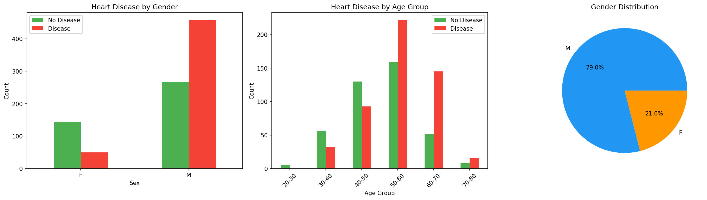
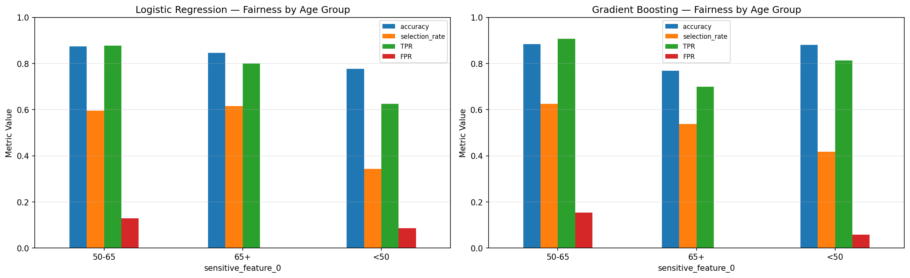
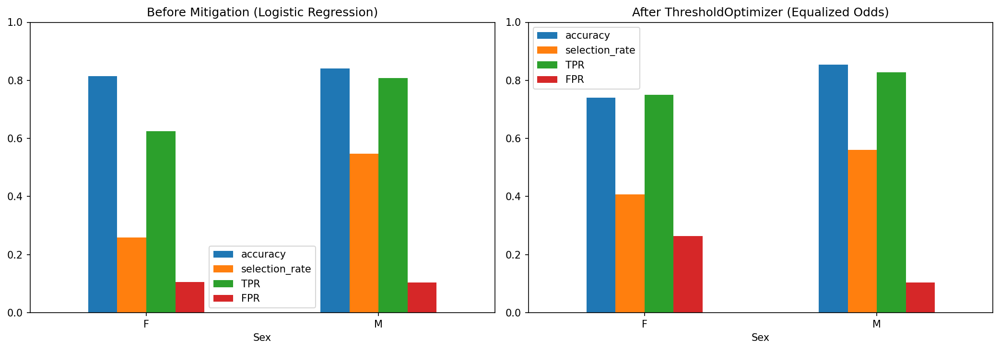
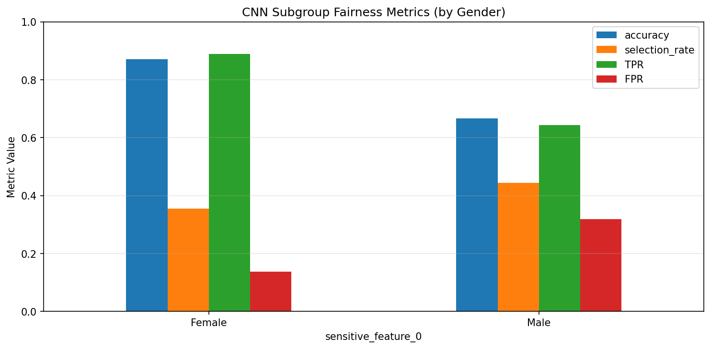
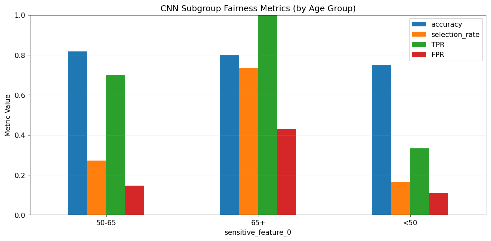
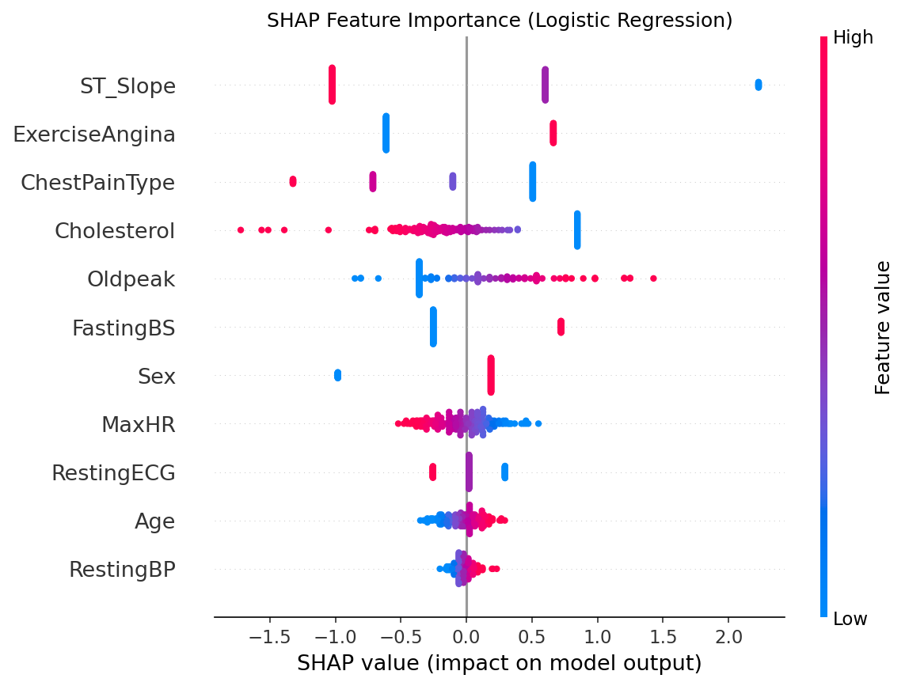
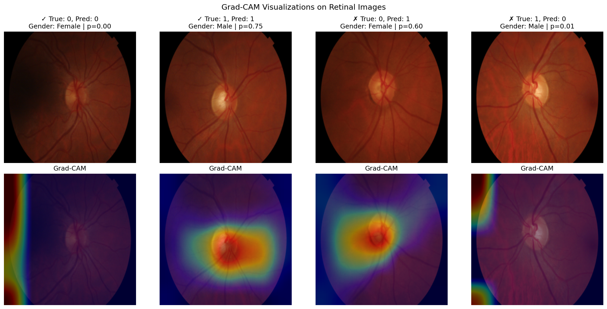
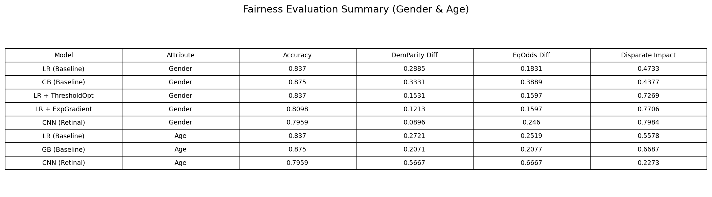

# Fairness Evaluation of Gender and Age in Medical Disease Diagnosis

**DSCI 531 - Fairness in Artificial Intelligence** | University of Southern California | 2026

**Authors:** Vedant Bhenia, Prem Doshi, Vineet Kumar Loyer

---

## Overview

This project audits two AI diagnostic pipelines for gender- and age-related fairness:

1. **UCI Heart Failure** (tabular) — Logistic Regression and Gradient Boosting classifiers on 918 patient records.
2. **PAPILA Retinal Fundus** (imaging) — A ResNet18 transfer-learning model for glaucoma detection on 488 images from 244 patients.

For both pipelines we compute subgroup metrics (Accuracy, TPR, FPR, Selection Rate), three fairness criteria (Demographic Parity Difference, Equalized Odds Difference, Disparate Impact), apply post-hoc mitigation (ThresholdOptimizer, ExponentiatedGradient), and visualise model behaviour via SHAP, LIME, and Grad-CAM.

---

## Repository Structure

```
.
├── README.md                     # Project overview (this file)
├── requirements.txt              # Python dependencies
├── .gitignore
├── src/
│   ├── fairness_evaluation.py    # Main pipeline (tabular + imaging + fairness + mitigation)
│   └── download_papila.py        # Helper that fetches & prepares the PAPILA dataset
├── data/
│   └── README.md                 # Instructions for obtaining datasets
└── results/                      # Figures and summary tables (generated at runtime)
```

---

## Quick Start

### 1. Set up the environment (Python 3.11+ recommended)

```bash
git clone https://github.com/VineetLoyer/Fairness-Evaluation-of-Gender-and-Age-in-Medical-Disease-Diagnosis.git
cd Fairness-Evaluation-of-Gender-and-Age-in-Medical-Disease-Diagnosis
python -m venv venv
# Windows
venv\Scripts\activate
# macOS / Linux
source venv/bin/activate
pip install -r requirements.txt
```

### 2. Obtain the datasets

- **UCI Heart Failure**: download `heart.csv` from [Kaggle](https://www.kaggle.com/datasets/fedesoriano/heart-failure-prediction) and save it as `data/heart.csv`.
- **PAPILA Retinal Fundus**: run the helper script below to download (~590 MB) and prepare the dataset.

```bash
python src/download_papila.py
```

### 3. Run the full pipeline

```bash
python src/fairness_evaluation.py
```

All figures and a summary CSV are written to `results/`.

---

## Key Results

### Heart Disease — Baseline Fairness Gaps

| Model | Accuracy | DemParity Diff | EqOdds Diff | Disparate Impact |
|---|---|---|---|---|
| Logistic Regression (Gender) | 83.7% | 0.289 | 0.183 | 0.47 |
| Gradient Boosting (Gender)   | 87.5% | 0.333 | 0.389 | 0.44 |
| Logistic Regression (Age)    | 83.7% | 0.272 | 0.252 | 0.56 |
| Gradient Boosting (Age)      | 87.5% | 0.207 | 0.208 | 0.67 |

All baselines exceed 80% accuracy but fail the four-fifths rule (DI < 0.8). Males receive positive predictions ~2x more than females.




### Heart Disease — Mitigation Works

| Model | Accuracy | DemParity Diff | EqOdds Diff | Disparate Impact |
|---|---|---|---|---|
| LR Baseline           | 83.7% | 0.289 | 0.183 | 0.47 |
| + ThresholdOptimizer  | 83.7% | **0.153** | **0.160** | **0.73** |
| + ExponentiatedGradient | 81.0% | **0.121** | **0.160** | **0.77** |

Both methods cut the demographic parity gap by more than 50% with ≤2.7% accuracy loss.



### Retinal Imaging — CNN Fairness (Gender + Age)

**ResNet18 on PAPILA**: overall accuracy 79.6%, AUC 0.87.

| Attribute | Accuracy | DemParity Diff | EqOdds Diff | Disparate Impact |
|---|---|---|---|---|
| Gender | 79.6% | 0.090 | 0.246 | 0.80 |
| Age    | 79.6% | **0.567** | **0.667** | **0.23** |

The CNN looks relatively fair on gender but exhibits severe age bias — patients aged 65+ have a 42.9% false positive rate, roughly 4x that of the under-50 group.




### Interpretability

**SHAP** on Logistic Regression shows the top drivers are ST_Slope, Oldpeak, ChestPainType, and MaxHR. Sex has low direct SHAP importance, meaning gender bias propagates through correlated proxy features rather than the sensitive attribute itself.



**Grad-CAM** confirms the CNN attends primarily to the optic disc region — clinically appropriate for glaucoma. Correct predictions yield focused heatmaps while misclassifications produce diffuse attention.



### Comprehensive Summary



---

## Takeaways

1. **Accuracy alone is insufficient.** All baselines exceed 80% accuracy yet fail the four-fifths rule for disparate impact.
2. **No single metric or attribute tells the whole story.** The CNN is fair on gender (DI = 0.80) but has severe age bias (EOD = 0.667). Multi-attribute auditing is essential.
3. **Mitigation works and the cost is small.** Post-hoc methods cut fairness gaps by >50% with at most 2.7% accuracy loss.
4. **Bias propagates through proxies.** SHAP shows sensitive attributes rarely have the highest direct importance; removing them does not remove bias.

---

## Reproducibility Notes

- Seeds are fixed (`RANDOM_SEED = 42`) in `src/fairness_evaluation.py`.
- Patient-level train/test split for PAPILA prevents leakage between OD and OS eyes of the same patient.
- Class-weighted BCE loss handles the 2:1 healthy:glaucoma imbalance.
- CNN training uses ImageNet normalisation + augmentation (flips, rotation, color jitter, affine).
- The best-validation checkpoint is restored before test evaluation.

Runtime (CPU): ~10 minutes for the heart pipeline, ~30–60 minutes for CNN training depending on hardware. A GPU reduces CNN training to under 5 minutes.

---

## References

1. Mehrabi et al., *A survey on bias and fairness in machine learning*, ACM Computing Surveys, 2021.
2. Obermeyer et al., *Dissecting racial bias in an algorithm used to manage the health of populations*, Science, 2019.
3. Rajkomar et al., *Ensuring fairness in machine learning to advance health equity*, Nature Medicine, 2018.
4. Banerjee et al., *"Shortcuts" causing bias in radiology artificial intelligence*, J. Am. Coll. Radiol., 2023.
5. Kovalyk et al., *PAPILA: Dataset with fundus images and clinical data of both eyes*, Scientific Data, 2022.
6. Fedesoriano, *Heart Failure Prediction Dataset*, Kaggle, 2021.

---

## License

This project is released for academic and educational purposes as part of DSCI 531 coursework.
